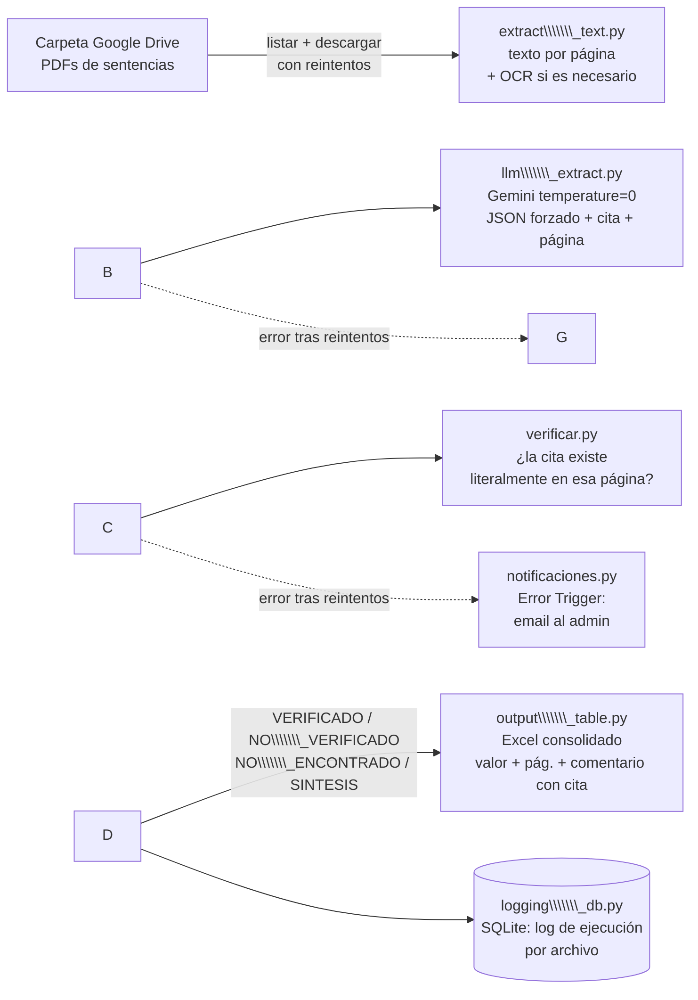

# Proyecto Final · Automatización e IA para MVP's · MBAn UAI 2026-1S

## 1 · Identificación

* **Integrantes:** Tomás Guzmán, Sebastián Leal, Cristóbal Mancilla
* **Track:** A · Caso real
* **Tipo declarado:** Automatización con componente de IA (extracción estructurada + verificación anti-alucinación)

## 2 · Resumen ejecutivo

`agente\\\\\\\_condenas` es un agente que automatiza la lectura y el análisis de
sentencias judiciales (PDFs) para Etcheberry, Leal \& asociados. Hoy este trabajo lo hace manualmente un par de personas:
abre cada sentencia, la lee completa y transcribe a mano \~12 campos clave
(tribunal, roles, delitos, decisión, ministros, voto disidente, etc.) a una
planilla. El agente reemplaza esa lectura y transcripción manual: toma los
PDFs desde una carpeta de Google Drive, extrae los campos con un LLM
(Gemini) y **verifica con código —no con otro LLM— que cada dato citado
exista literalmente en el documento**, antes de entregarlo en una tabla
Excel consolidada dentro de la carpeta del agente. La métrica que mueve es el **tiempo humano dedicado a
lectura y transcripción manual por sentencia**, los detalles más cruciales e importantes se sugiere plenamente ser realizado por un humano


· Problema y solución

**El dolor:** el usuario final —quien hoy hace este trabajo— debe leer
sentencias completas (a veces >10 páginas, a veces escaneadas) y
transcribir a mano campos objetivos a una planilla, sentencia por
sentencia. Es lento, repetitivo, y propenso a error de transcripción.

Herramientas de Inteligencia Artificial como notebookLM, de las más

objetivas y menos propensas a alucinar, terminaba con estos problemas, por lo que

integrar IA y LLM propone obstáculos considerables que dificultan la automatización

y reducción de tiempo usado en esta tarea.

**Por qué este dolor y no otro:** es un cuello de botella recurrente y
medible (horas-persona por sentencia), con un output objetivamente
verificable (los datos están literalmente en el texto), lo que lo hace
apto para automatizar con un control de calidad automático en vez de
confiar ciegamente en un LLM.

**La solución:** un pipeline que:

1. Lee los PDFs pendientes de una carpeta de Drive.
2. Extrae el texto de cada página (con OCR automático si el PDF viene
escaneado).
3. Le pide a Gemini (temperature=0, salida JSON forzada) que extraiga cada
campo **junto con la cita textual exacta y la página** de donde lo sacó.
4. Verifica con código —búsqueda de texto determinística, sin LLM— que esa
cita exista realmente en esa página. Si no calza, el campo queda
marcado `NO\\\\\\\_VERIFICADO` en vez de darse por bueno.
5. Entrega una tabla Excel donde cada celda muestra el valor + la página, y
un comentario de Excel con la cita textual completa — la referencia
queda directamente en la tabla, sin depender de abrir el PDF original.

Por qué se eligió así: el riesgo real de usar un LLM en un dominio legal es
que "suene bien" y esté mal. Este diseño no le pide al modelo que "no
invente" (eso no funciona de forma confiable), verifica su output con
código después, y dejar rastro (página + cita) en cada fila para que el
humano audite en segundos, no en minutos o incluso horas.

## 4 · Arquitectura



**Flujo de datos:** Drive (input) → extracción de texto → LLM con citas →
verificación determinística → Excel (output). En paralelo, cada PDF
procesado deja un registro en la BBDD de ejecuciones, y si algo falla tras
los reintentos, se dispara un aviso por email al administrador o en la consola.

## 5 · Las 4 verticales

|Vertical|Capa cumplida|Dónde está la evidencia|
|-|-|-|
|**Automatización**|Capa 1 (sin n8n, código propio con IDE agéntico → también aporta a Capa 2)|`/src/agente\\\\\\\_condenas/main.py` implementa los 3 mecanismos: **Retries** (`reintentos.py`, usado en descarga de Drive y llamada a Gemini), **Continue on Fail** (try/except por PDF en `main.py`, el flujo sigue con los demás), **Error Trigger** (`notificaciones.py`, avisa por email si hubo fallas). Se reemplazó n8n por Python + Claude Code porque la lógica de verificación anti-alucinación (búsqueda de texto determinística) es más natural y auditable como código que como nodos visuales.|
|**IA**|Capa 1 cumplida, con guardrails que apuntan a Capa 2|Llamada real a Gemini en `llm\\\\\\\_extract.py`. El prompt está en `config.py` (`SYSTEM\\\\\\\_PROMPT`), no escondido en un nodo. El resultado (valor + cita + página) se usa en pasos posteriores: `verificar.py` lo valida y `output\\\\\\\_table.py` lo consolida. Guardrails: JSON forzado contra un schema de 12 campos + reglas explícitas ("nunca inventes", citas ≤25 palabras, `null` si no aparece).|
|**BBDD**|Capa 1 (logs de ejecución)|El negocio no requiere una BBDD transaccional (el entregable es el Excel), así que se guardan logs de cada corrida en SQLite: `logging\\\\\\\_db.py` (tabla `ejecuciones`: archivo, estado, detalle, timestamp). `\\\\\\\[COMPLETAR si migran a Supabase/Postgres para optar a Capa 2 con RLS]`|
|**Front / Touchpoint**|Capa 1|Capa 1 cumplida (ver sección 6: Drive como gatillo, Excel como resultado). Capa 2 (UI propia) deliberadamente no implementada — se priorizó el tiempo en robustecer el backend (verificación anti-alucinación, manejo de errores) antes que en una interfaz visual, dado que Capa 1 ya resuelve el dolor real del usuario sin fricción adicional.|

## 6 · Touchpoint del usuario

El usuario final (quien hoy analiza sentencias a mano) **no interactúa con
código ni con una consola**: su único punto de contacto es una carpeta
compartida de Google Drive.

1. El usuario deja los PDFs de sentencias nuevas en esa carpeta (como ya
hace hoy, sin cambiar su flujo de trabajo).
2. Hoy el agente se corre **bajo demanda** desde la terminal
(`python main.py --carpeta-id ... --salida sentencias.xlsx`); dado que
ya no reprocesa PDFs ya procesados (se registran en una BBDD local),
correrlo seguido y dejarlo con una tarea programada (cron / Task
Scheduler) es un cambio simple pendiente de coordinar con el cliente.
3. El resultado es un archivo Excel (`sentencias\\\\\\\_consolidadas.xlsx`) que
hoy queda en el equipo de quien ejecuta el script; si es de usarse en su estado funcional, see puede coordinar que se ejecute el script por parte del equipo y entregarle el excel en cosa de un par de minutos.
4. Cada fila indica si "requiere revisión" y cada celda trae la página y la cita de respaldo como
comentario de Excel que puede ver el usuario final para darle el análisis final del texto

## 7 · Cómo correrlo

Setup mínimo (detallado en `/src/agente\\\\\\\_condenas/INICIO\\\\\\\_RAPIDO.md`):

```bash
cd src/agente\\\\\\\_condenas
pip install -r requirements.txt
cp .env.example .env    # completar GEMINI\\\\\\\_API\\\\\\\_KEY, GOOGLE\\\\\\\_SERVICE\\\\\\\_ACCOUNT\\\\\\\_JSON, CARPETA\\\\\\\_DRIVE\\\\\\\_ID
export $(grep -v '^#' .env | xargs)
python main.py --carpeta-id "$CARPETA\\\\\\\_DRIVE\\\\\\\_ID" --salida sentencias.xlsx
```

Credenciales necesarias (mock/instrucciones completas en `INICIO\\\\\\\_RAPIDO.md`):

* **Gemini:** API key personal ([aistudio.google.com/apikey](https://aistudio.google.com/apikey)).
* **Google Drive:** cuenta de servicio con permiso de **Lector** en la
carpeta (ya no se sube nada de vuelta a Drive, solo se lee).
* **Error Trigger (opcional):** credenciales SMTP + `ADMIN\\\\\\\_EMAIL` en `.env`;
si no se configuran, el aviso solo se imprime en consola.

## 8 · Sección Track A

* **Cliente identificado:** Etcheberry, Leal \& asociados
* **Evidencia de contacto:** https://meet.google.com/eej-hfio-wuo (meet en que se realizó reunión con abogada que compartió las dificultades de la lectura de sentencias
* **Dolor descrito + cifras del estado actual: Alta cantidad de archivos para documentar tanto en cantidad, o incluso en tamaño, cual requiere semanas o meses de tiempo. Ayudarse directamente con LLM tradicionales puede llevar a información erronea y "alucinaciones" que perjudican considerablemente este proceso. Ejemplo: archivo de más de 700 páginas que requirió una semana (aprox 30 horas en esta tarea) en documentar.** 
* **Resultado post-MVP cuantificado: Tiempo de análisis y documentación reducido en más de un 90% con la seguridad de tener información objetiva y corroborable gracias a un agente estructurado (dentro del análisis que se hizo de varios documentos entre 10-25 páginas). Tener la información dentro de un mismo Excel que automáticamente rellena los valores es un proceso que cambia considerablemente el tiempo que se usa en registrar manualmente la información objetiva.**
* **Plan de handoff:** Si resulta útil en documentos grandes, se puede dedicar un día en dejar todo configurado con sus llaves API y un plan pagado de gemini al cliente, junto a una UI amigable y confiable con los contenidos, para que pueda usarlo en el día a día de forma consistente.

## 9 · Limitaciones y próximos pasos

**Fuera de alcance / limitaciones conocidas:**

* No hay UI propia: el punto de contacto es la carpeta de Drive + el Excel
resultante (Front Capa 2 pendiente).
* El campo `resumen\\\\\\\_causa` es una síntesis editorial y **siempre** se marca
para revisión humana por diseño — no es un bug, es la política de la
herramienta ante contenido no verificable palabra por palabra.
* El OCR puede fallar o rendir mal en escaneos de baja calidad o inclinados.
* El log de ejecuciones es SQLite local, no una BBDD compartida en la nube
(no hay RLS ni multiusuario todavía).
* Documentos de alta cantidad de páginas necesita de LLM pagados, como también ver el desempeño del agente en estos

**Próximos pasos:**

* Migrar el log de ejecuciones a Supabase/Postgres con RLS (Capa 2 BBDD).
* Agregar una UI mínima (ej. Lovable) para subir PDFs y ver el estado de la
cola sin tocar Drive directamente (Capa 2 Front).
* Programar la ejecución con cron / Task Scheduler y confirmar cadencia
real con el cliente.

## 10 · Roles del equipo

|Integrante|Rol / qué hizo|
|-|-|
|Tomás Guzmán|Arquitectura y desarrollo del pipeline completo: integración con la API de Gemini (`llm\\\\\\\_extract.py`) y Google Drive (`drive\\\\\\\_sync.py`), diseño del sistema de verificación anti-alucinación (`verificar.py`), manejo de errores (retries, continue-on-fail, error trigger), log de ejecuciones en BBDD, pruebas de diseño, debug y consolidación en la tabla Excel final.|
|Sebastián Leal|Validación y agrupación de datos con criterios técnicos objetivos: consiguió los PDFs reales de sentencias usados para probar el agente y comprobó manualmente su contenido contra el output del sistema.|
|Cristóbal Mancilla|Testing y comprobación de documentos en paralelo: corrió pruebas con sentencias reales de distintos tribunales y delitos, contrastando campo por campo el Excel resultante contra el PDF original para validar la precisión de la extracción y el correcto funcionamiento de la verificación de citas.|


